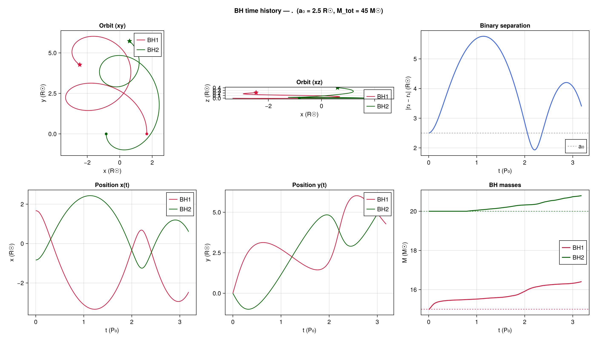
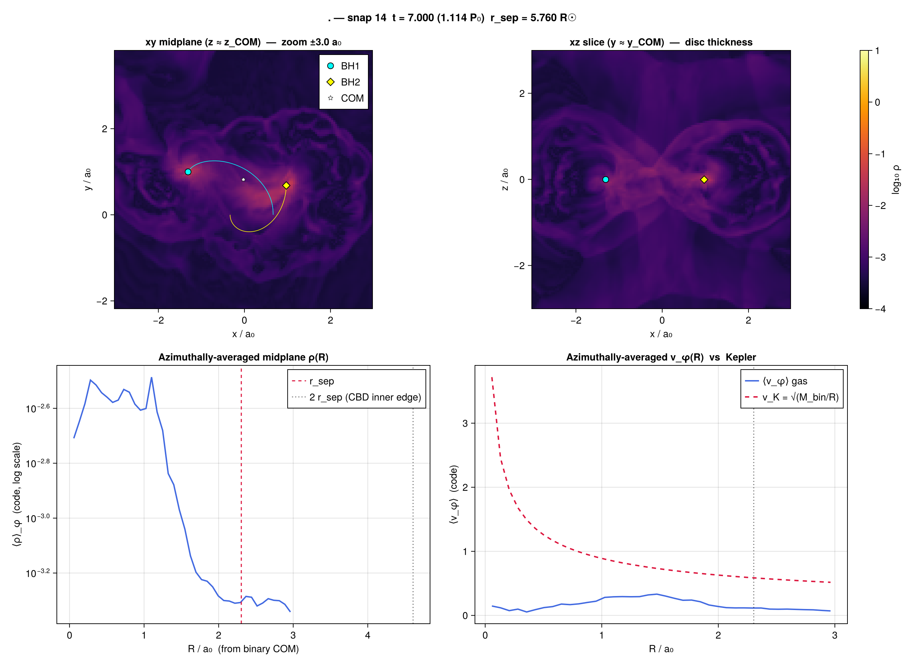
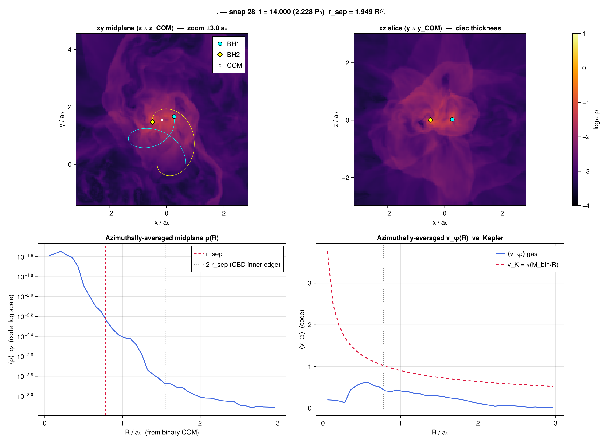
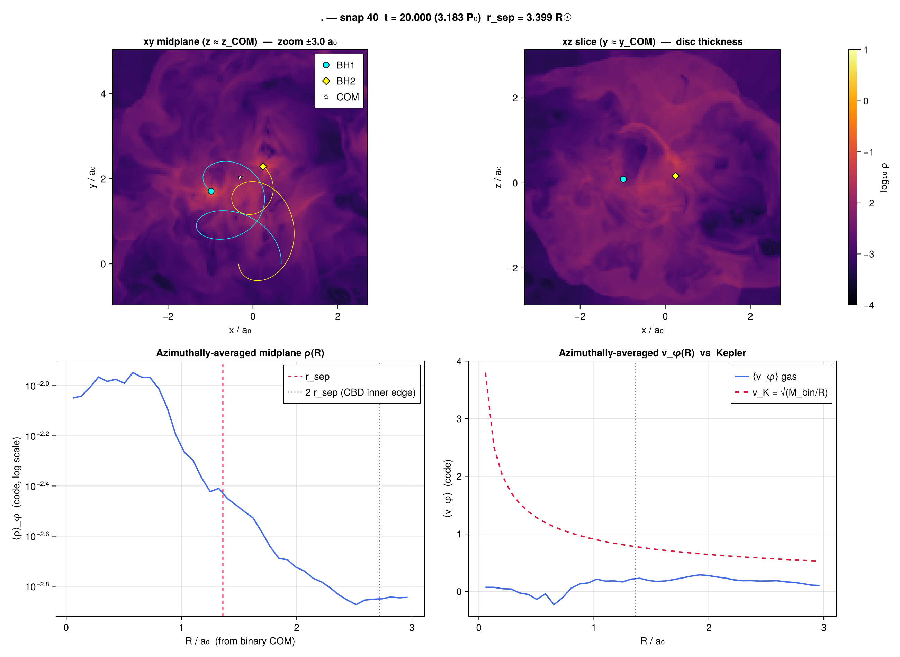
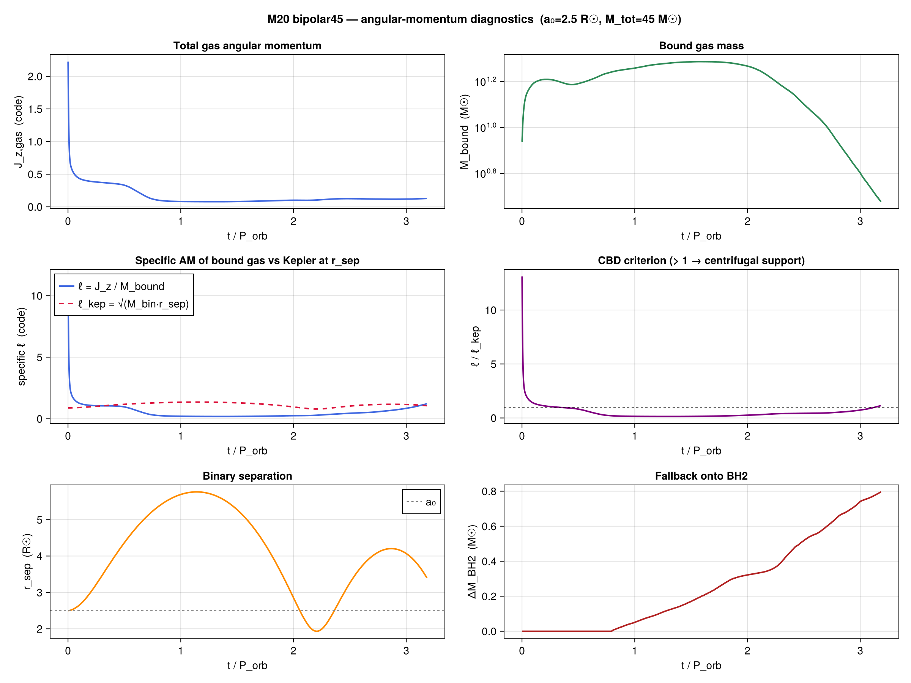
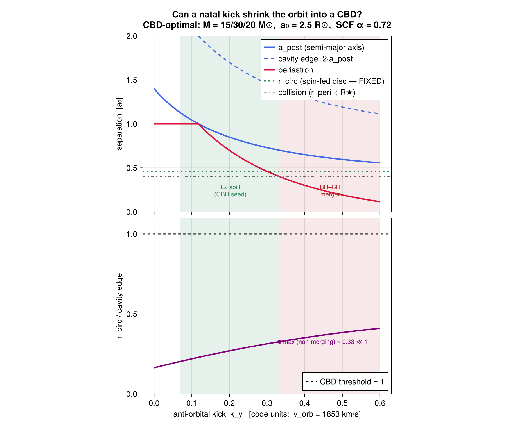

# CBD-from-fallback campaign — result

**Question:** can the fallback from a supernova in a close BH–binary form a
*circumbinary disc* (CBD) — a rotationally-supported gas structure outside the
binary orbit that could power post-SN accretion and shape the eventual GW source?

**Answer (this run):** **No.** Even with a genuinely tidally-distorted (Roche)
progenitor and the circumbinary region fully on the grid, the bound fallback is a
thick, turbulent, **sub-Keplerian** cloud — it never becomes a disc. The physics
that *does* occur is **gas-assisted hardening**: the binary survives, stays
eccentric, and its orbit decays as it ploughs through the bound fallback.

---

## 1. Why this run

The angular-momentum pre-flight (`scripts/predict_disk.jl`, the *spin-cap
theorem*) predicts that radial-bomb SN fallback gets its disc-forming AM only
from stellar spin, which circularises at `r_circ = Ω_spin² R★⁴ / M_BH2`. Even at
breakup this caps at `r_circ|_brk = (M★/M_BH2)·R★`, which is **interior to the
orbit** for any non-contact binary — so spin-fed fallback can only make a
mini-disc, never a CBD. A CBD needs *orbital*-scale AM, which a tidally-distorted
(Roche-lobe-filling) progenitor can in principle supply.

This campaign tests exactly that: build the progenitor by relaxing a Lane-Emden
polytrope in the binary's **co-rotating frame** (`relax_ic!` with Ω = Ω_orb;
centrifugal + Coriolis support → the L1/L2 tidal bulge the symmetric SCF figure
lacks), explode it, and follow the fallback long enough, in a box large enough,
to see whether a CBD forms.

An earlier L=2 box run (NX=96, CPU) was *inconclusive*: the binary widened to
≈ the box half-width, so the circumbinary region (R > 2·r_sep) sat off-grid.
**This run uses L=6** so that region is contained.

## 2. Setup

| Parameter | Value |
|---|---|
| Masses | M_BH1 = 15, M★ = 30, M_BH2,init = 20 M☉ (ΔM/M_preSN = 0.22, Blaauw-safe) |
| Separation | a₀ = 2.5 R☉ (tight → strong tidal distortion) |
| IC | co-rotating Roche relaxation (`--relax-ic`), self-gravity on |
| Bomb | E_SN = 5×10⁴⁹ erg, inner-half by mass (`--bomb-mass-frac 0.5`), spherical |
| Kick | small prograde tangential (`--v-kick-y -0.015`) |
| Box / grid | L = 6 a₀, NX = 256 (R★/dx ≈ 8.5) |
| Evolution | t_end = 20 (≈ 3 P₀), torque-free sinks |

Run on a single A100 (NAS/cabeus, `gpu_normal`) via
`scripts/run_relax_optimal.pbs`: **~5.9 h walltime**, completed cleanly (rc=0),
3 periodic checkpoints written, no resubmit needed.

## 3. Results

### The binary survives and hardens



The binary stays **bound and eccentric** (e ≈ 0.5), with `r_sep` oscillating
between periastron ≈ 0.8 a₀ and apastron ≈ 2.3 a₀. Crucially the **apastron
decays** — 2.30 → ~1.7 a₀ (5.7 → 4.3 R☉) over ~3 orbits — as dynamical friction
from the bound fallback extracts orbital energy. Both BHs accrete modestly
(ΔM_BH2 → +0.8, ΔM_BH1 → +1.5 M☉).

### The gas is sub-Keplerian — no disc

The single most diagnostic panel is the azimuthally-averaged ⟨v_φ⟩(R) (blue) vs
the Keplerian curve √(M_bin/R) (red dashed). At every snapshot the gas rotation
is **flat and low (⟨v_φ⟩ ≈ 0.2–0.4)**, far below Keplerian at all radii — the
signature of a pressure/turbulence-supported cloud, not a rotationally-supported
disc. The density falls to the floor well inside 2·r_sep; there is essentially no
mass in the circumbinary region.

| t = 7 (first apastron) | t = 14 (≈periastron) | t = 20 (final) |
|---|---|---|
|  |  |  |

### Angular-momentum budget confirms it



- **Total gas AM** falls from ~2.2 to ~0.1 in the first orbit as unbound ejecta
  carries it out of the box, then holds ~0.1–0.15.
- **Bound gas mass** peaks ~19 M☉ at t ≈ 2 P₀, then drains to ~5 M☉ — consumed by
  accretion and ejected at periastron passages.
- **CBD criterion** ℓ_bound/ℓ_kep stays **below 1** for the whole run: the bound
  gas never reaches the specific AM needed for centrifugal (disc) support.
- **Fallback onto BH2** climbs monotonically to ΔM_BH2 ≈ +0.8 M☉.

## 4. Conclusion

With the circumbinary region on-grid, the spin-cap prediction is **confirmed**:
the orbital-scale AM that the Roche IC *does* inject (it retains ~3× the gas AM of
the symmetric SCF channel) circularises **interior** to the binary, stays
sub-Keplerian, and **torques the binary** — it does not assemble a disc. The
CBD-from-SN-fallback channel is closed for this regime.

The result of interest is therefore not a disc but a **gas-hardened, surviving,
eccentric BH–BH binary**: the fallback acts as a transient drag medium that
shrinks the orbit before being accreted/ejected. That is arguably a cleaner GW
progenitor story than a CBD.

## 5. Reproduce

```bash
# on cabeus (NAS), single A100, gpu_normal:
git pull origin main
qsub -v NX=256 scripts/run_relax_optimal.pbs        # ~6 h, t_end=20

# analysis (from the repo root, on the output dir):
D=demo1/output_relax_optimal_a25rsun_L6_bh15_20_esn005_bombmf05_kickm0.015_nx256
julia --project=. scripts/plot_sn50_cbd.jl --outdir "$D" --snap 40 --a0-rsun 2.5
julia --project=. scripts/plot_sn50_bh_history.jl --outdir "$D" --a0-rsun 2.5 --mtot-msun 45
julia --project=. scripts/plot_sn50_am.jl --outdir "$D" --a0-rsun 2.5 --mtot-msun 45
```

The GPU self-gravity / co-rotating-relaxation / diagnostics paths had to be made
device-resident for this to run on the A100 (they had only ever run on CPU);
see commits `da295d5`, `15cf39b`, `353d0cd`. Checkpoint/restart + the PBS
auto-resubmit chain (`a0b5e67`, `0721932`, `0b1ec88`) let a run span the 24 h
walltime cap, though at NX=256 (~6 h) it finishes in one job.

## 6. Known limitations / next

- **Resolution:** the *null CBD result is robust* — ⟨v_φ⟩ misses Keplerian by a
  wide margin at all R. The *hardening rate* (apastron-decay slope) is set by
  turbulent drag and may be resolution-sensitive; an NX=384 run would pin it down
  for a quantitative result.
- **Single point in parameter space:** tighter a₀ (deeper Roche overflow), weaker
  E_SN (more bound fallback), or a genuine pre-existing circumbinary reservoir
  remain the only routes to a CBD that this campaign has not excluded. (A fourth
  lever — tuning the natal kick to shrink the orbit — is excluded analytically;
  see §7.)

## 7. The kick lever — checked, and it can't make a CBD

A natural follow-up: rather than inject more angular momentum, *tighten the
binary* so the fixed spin-fed mini-disc (radius `r_circ`) becomes circumbinary.
`r_circ` is set by the pre-SN star, so a post-SN kick that shrinks the separation
`a_post` lowers the cavity bar `2·a_post` **without touching `r_circ`** — a real
decoupling the static spin-cap scan can't see. `scripts/predict_disk.jl
--scan-kick` (figure from `scripts/plot_cbd_kick.jl`) solves the Blaauw
mass-loss + kick orbit and re-tests the disc fate at `a_post`. Two walls close
the route:

1. **Energetics.** An instantaneous kick at separation a₀ can shrink the
   semi-major axis to at most **a₀/2**, and only by zeroing the relative velocity
   — which drives periastron → 0, a head-on BH–BH plunge. Mass loss pushes the
   other way (it widens). A bound, *surviving* binary therefore stays near
   `a_post ≳ a₀`.
2. **Geometry.** Even at that unreachable floor the cavity edge `2·a_post` never
   falls to `r_circ`. For the CBD-optimal config `r_circ = 0.46 a₀` (fixed) while
   a settled CBD needs `a_post ≤ 0.23 a₀` — sub-stellar-radius, i.e. a contact
   configuration, not a binary.



Sweeping the anti-orbital kick `k_y` (figure): as the kick grows the orbit
tightens, but periastron crosses the collision radius (`r_peri < R★`) at
`k_y ≈ 0.33` (~620 km/s) and the pair **merges** before the cavity edge ever
reaches `r_circ`. The `r_circ`/cavity ratio peaks at **0.33 ≪ 1** on the last
non-merging orbit. The only thing the kick buys on the way is a stronger
BH2-lobe overflow — a more vigorous **L2 spill (CBD seed)** in the
`k_y ≈ 0.08–0.33` window — never a settled disc.

So the kick is **not** a fourth CBD route: it lands the system in L2-spill or in
a BH–BH merger. This is consistent with the spin-cap theorem — the obstruction is
the *separation-independent* ratio of spin AM to orbital AM, which a kick cannot
change.
