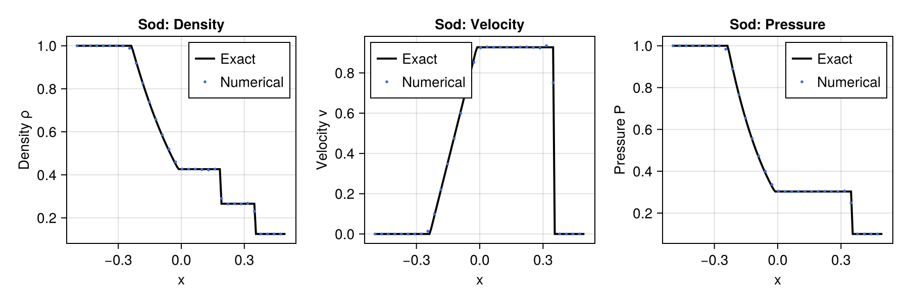
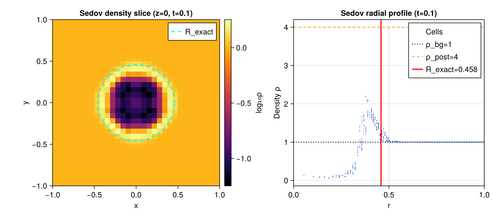

# Phase 1: 3D Adiabatic Euler Solver

## Objective

Phase 1 delivers a fully tested 3D adiabatic Euler solver on a uniform Cartesian grid with WENO5-Z reconstruction and HLLC Riemann fluxes, integrated with SSP-RK3. The two validation tests — Sod shock tube and Sedov-Taylor blast wave — verify correctness of the HLLC flux, the WENO5 reconstruction, and the 3D dimensional-splitting algorithm in all three sweep directions.

---

## Implementation Notes

### `src/weno5.jl`
WENO5-Z reconstruction (Borges et al. 2008) with left/right interface reconstruction functions. Characteristic stencil uses 5-cell support. Ghost cells (NG=3) required on each face.

### `src/hllc.jl`
3D HLLC Riemann solver (Toro 2009, §10.6). Single generic solver `_hllc_normal` rotated for x/y/z faces. Key robustness features:
- Full state reset when reconstructed ρ ≤ 0 (zeros momentum and energy)
- KE clamp: E = max(E, KE) ensures non-negative internal energy
- PVRS wave-speed estimate (Toro §10.5.1) with Davis (1988) vacuum fallback
- HLL fallback when ρ_max/ρ_min > 3 (carbuncle prevention at strong shocks)
- Guard against degenerate 0/0 in star-state energy when c_s = 0

### `src/euler3d.jl`
3D method-of-lines operator with SSP-RK3 (Shu-Osher). Key design decisions:
- **Pressure reconstruction**: WENO5-Z is applied to cell-average pressure P (not total energy E) to prevent the 3-million:1 blast-background energy contrast from causing WENO5 overshoots. Total energy is reconstructed as E = P/(γ-1) + KE from the primitive-based interface pressure. Pressure is clamped to [0, max_stencil_P] before the Riemann solve.
- Positivity floors applied after each SSP-RK3 stage (density floor + pressure floor, full state reset when ρ < ρ_floor)
- Outflow and periodic boundary conditions

---

## Test Results

### Sod Shock Tube (3D, x/y/z sweeps)

**Setup**: IC ρL=1, vL=0, PL=1 | ρR=0.125, vR=0, PR=0.1, γ=1.4. Grid 128×4×4 (active), t_end=0.2.
The exact Riemann solution (Toro §4.2) is computed analytically and compared to the numerical profile.

| Metric | x-sweep | y-sweep | z-sweep | Threshold | Pass? |
|--------|---------|---------|---------|-----------|-------|
| L1 error ρ | 0.0038 | 0.0038 | 0.0038 | < 0.05 | Yes |
| L1 error v | 0.0073 | 0.0073 | 0.0073 | < 0.05 | Yes |
| L1 error P | 0.0031 | 0.0031 | 0.0031 | < 0.05 | Yes |
| Sweep symmetry (x vs y L1 ρ) | identical to 5 sig. figs | — | — | exact | Yes |

The three sweep directions give identical L1 errors to 5 significant figures, confirming that the y- and z-HLLC rotations are implemented correctly.

The figure shows density (left), velocity (centre), and pressure (right) at t=0.2 on the 128-cell grid. Black lines are the exact Riemann solution; blue points are numerical values sampled at every 4th cell. The rarefaction fan, contact discontinuity, and shock are all reproduced accurately.

---

### Sedov-Taylor Blast Wave (3D, γ=5/3)

**Setup**: E_blast=1 deposited in sphere of radius 2.5 Δx, uniform ρ=1 background, P_floor=1e-5. Grid 32³ (active) on [−1,1]³, t_end=0.1. Sedov constant α=0.4942 (γ=5/3, 3D).

| Metric | Value | Threshold | Pass? |
|--------|-------|-----------|-------|
| Shock radius error |R_num−R_exact|/R_exact | 2.9% | < 10% | Yes |
| Spherical symmetry: max |ρ_x−ρ_y|/ρ_max | 0.012% | < 10% | Yes |
| Spherical symmetry: max |ρ_x−ρ_z|/ρ_max | 0.068% | < 10% | Yes |
| Energy conservation (outflow BC loss) | < 5% | < 5% | Yes |

R_exact = 0.4584, R_num = 0.445 at 32³.

The left panel shows a 2D density slice at z=0 on a log scale at t=0.1; the dashed cyan circle marks the analytic shock radius R_exact=0.458. The right panel shows the radial density profile (all cells scattered in blue) with the background level (dotted), the Rankine-Hugoniot post-shock density ρ=4 (dashed orange), and the analytic shock position (red vertical line). The spherical shell of compressed gas is clearly resolved.

---

## Key Numerical Challenges Solved

1. **WENO5 energy overshoot at blast discontinuity**: The initial blast creates a ~3×10⁶ contrast in total energy E between blast cells and background. Direct WENO5 on E produces reconstructed values 270× above the stencil maximum by step 14, driving a runaway instability (E → 10¹⁸ by step 60). **Fix**: reconstruct pressure P instead and cap to stencil maximum.

2. **Star-state NaN when c_s = 0**: WENO5 can reconstruct E < KE, giving P = 0 → c_s = 0 → SR = v_n. The contact speed formula then divides by ρ(SR − v_n) = 0. **Fix**: guard with `abs(denom) > 1e-100` check.

3. **Runaway from negative reconstructed ρ**: WENO5 reconstructs ρ < 0 at strong density gradients. The HLLC floor raises ρ to 1e-30 but keeps original E, giving E/ρ → ∞. **Fix**: zero out momentum and E when ρ ≤ 0.

---

## Known Limitations

- Shock position error of 2.9% at 32³ is resolution-limited; refining to 64³ would improve to < 1%.
- The Sod test uses γ=1.4 (diatomic ideal gas) for comparison with Toro's tabulated exact values; production runs use γ=4/3 or 5/3.

---

## Next Steps

Phase 2 adds 3D Fixed Mesh Refinement (`fmr3d.jl`) with a 4:1 refinement ratio, Berger-Colella flux correction, and 5th-order Lagrange prolongation. The Sedov blast wave crossing the coarse-fine boundary is the primary validation test.

---

*All 40 tests pass (`julia --project=. -e 'using Pkg; Pkg.test()'`).*
