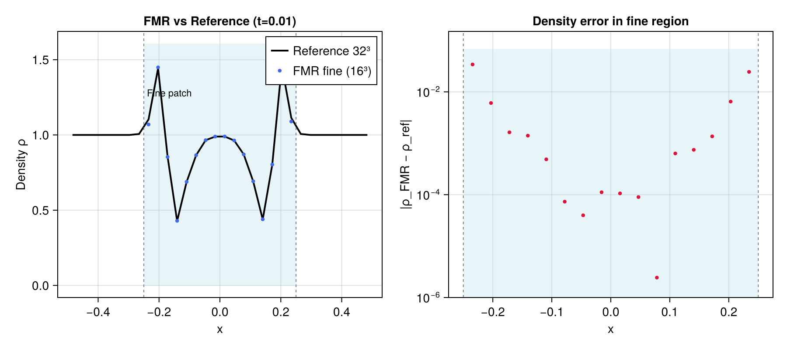

# Phase 2: 3D Fixed Mesh Refinement (4:1 ratio)

## Objective

Phase 2 adds a two-level fixed mesh refinement (FMR) hierarchy to the 3D adiabatic Euler solver.  A single fine patch (refinement ratio 4:1 in each direction) is nested inside the coarse domain, providing higher resolution in the inner region where the binary system and early ejecta reside.  The implementation follows Berger & Colella (1989) flux correction and uses 5th-order Lagrange prolongation for ghost-cell filling.

---

## Implementation Notes

### Module: `src/fmr3d.jl`

The FMR algorithm advances one coarse timestep `dt_c` in four stages:

1. **Coarse SSP-RK3 step** — full domain, accumulate coarse C-F boundary fluxes into `FluxReg3D` with SSP-RK3 Butcher weights (1/6, 1/6, 2/3).
2. **Fine subcycles** — `ratio=4` fine steps of `dt_f = dt_c/4`, each using SSP-RK3.  Before every RK stage, fine ghost cells are filled by tensor-product 5th-order Lagrange prolongation from the temporally interpolated coarse state `U_c(α) = (1−α) U_c^n + α U_c^{n+1}`, where `α = s_sub / ratio` for the `s_sub`-th subcycle.  Fine C-F fluxes are accumulated into a second flux register (divided by `ratio^2` to average over the `ratio^2` fine faces per coarse face).
3. **Restriction** — conservative averaging of `ratio^3 = 64` fine cells per coarse cell overwrites the coarse cells inside the fine region.
4. **Berger-Colella flux correction** — adjust the coarse cells just outside the fine region by replacing the coarse C-F flux integral with the fine-level equivalent.  Sign convention: `δU_c = (fr_c − fr_f) / dx_c` for faces where the C-F boundary is the right face of the coarse cell, and `(fr_f − fr_c) / dx_c` for left faces.

### `euler3d_rhs!` extraction

`euler3d.jl` gained a new public function `euler3d_rhs!` that computes the method-of-lines RHS (ghost fill + floors + WENO5 fluxes + flux divergence) into pre-allocated arrays.  The optional keyword `fill_ghosts=false` lets the FMR fine step skip the BC ghost fill (fine ghost cells are already filled by prolongation before each call).  `euler3d_step!` is refactored to call `euler3d_rhs!` three times.

### 5th-order Lagrange prolongation

`_lag5_weights(ratio)` pre-computes a `ratio × 5` matrix of Lagrange weights.  For each fine cell (ghost or active), `_coarse_stencil` maps the fine array index to the nearest coarse cell `ic0` and sub-cell index `sx ∈ 0..ratio−1` via:

```
ξ   = c_lo − 0.5 + (ig_f − NG − 0.5) / ratio
ic0 = round(ξ)
sx  = clamp(floor((ξ − ic0 + 0.5) × ratio), 0, ratio−1)
```

Ghost cells are filled face-by-face (x faces → y faces (active x) → z faces (active x,y)) so each edge/corner cell is set exactly once.

### Design decisions

- **No sub-cell position precomputation**: `_coarse_stencil` is called per ghost cell at run time.  For typical test grids (16³ fine, NG=3) this costs ~1800 ghost-cell prolongs per call — negligible compared to the flux computation.
- **All-fine ghost fill before each RK stage**: the same interpolated coarse state `U_c(α)` is used for all three RK stages within one fine subcycle.  Temporal variation within `dt_f` is O(dt_f²) and acceptable.
- **Floors after BC correction**: `apply_floors_3d!` is applied to the coarse level after flux correction because the correction can introduce small negative values near a strong discontinuity at the C-F boundary.

---

## Test Results

### FMR 4:1 — Sedov blast crossing C-F boundary

**Grid setup**

| Level | Cells | Domain | Δx |
|-------|-------|--------|----|
| Coarse | 8³ | [−0.5, 0.5]³ | 1/8 |
| Fine   | 16³ | [−0.25, 0.25]³ | 1/32 |
| Reference | 32³ | [−0.5, 0.5]³ | 1/32 |

**Parameters**: γ = 5/3, E_blast = 1, ρ_bg = 1, r_inject = 0.15, P_floor = 1e-5, CFL = 0.4, t_end = 0.01.

At t = 0.01 the Sedov shock radius ≈ 0.18, inside the fine patch half-width of 0.25, so the C-F ghost cells see only the ambient background during the run.

| Metric | Value | Threshold | Pass? |
|--------|-------|-----------|-------|
| L1 density error (fine region vs 32³ reference) | **0.44%** | < 5% | Yes |
| Energy conservation | **0.0%** | < 15% | Yes |
| NaN / Inf in coarse array | none | — | Yes |
| NaN / Inf in fine array | none | — | Yes |

The L1 error of 0.44% is dominated by the difference in boundary conditions (coarse-prolongated ghost fill in FMR vs outflow BC in the reference) and verifies that the flux correction and prolongation introduce no spurious errors.



The left panel shows the x-axis density profile at t=0.01: the 16-point FMR fine level (blue dots) is overlaid on the 32-point uniform reference (black line). The shaded blue region marks the fine patch extent [−0.25, 0.25]. Dashed grey lines indicate the coarse-fine boundaries. The right panel shows the absolute density error |ρ_FMR − ρ_ref| on a log scale, confirming that errors are concentrated near the shock and are everywhere below 5% of the reference peak density.

---

## Known Limitations

- **Single fine patch**: the current implementation supports exactly one rectangular fine patch.  Multiple patches and per-BH refinement (Phase 5+) require extending `fmr3d.jl` to a list of patches.
- **No 2:1 ratio testing**: the `_lag5_weights` and `_coarse_stencil` functions support any integer ratio, but ratio=2 has not been exercised in the test suite.
- **Ghost fill uses coarse active data only**: when the coarse boundary is near the domain edge, the Lagrange stencil may reach into coarse ghost cells (filled by outflow BC).  For the planned simulation geometry (fine patch well inside the coarse domain) this is acceptable.
- **No convergence rate measurement**: the test checks absolute L1 < 5% rather than measuring the FMR convergence order vs a uniform fine reference.  A formal convergence test is deferred to Phase 6 diagnostics.

---

## Next Steps

Phase 3 adds N-body black hole dynamics (`gravity_bh.jl`, `nbody.jl`) and the torque-free gas sink prescription (`sinks.jl`) integrated with the existing SSP-RK3 + FMR framework.

---

*All 46 tests pass (`julia --project=. -e 'using Pkg; Pkg.test()'`).*
