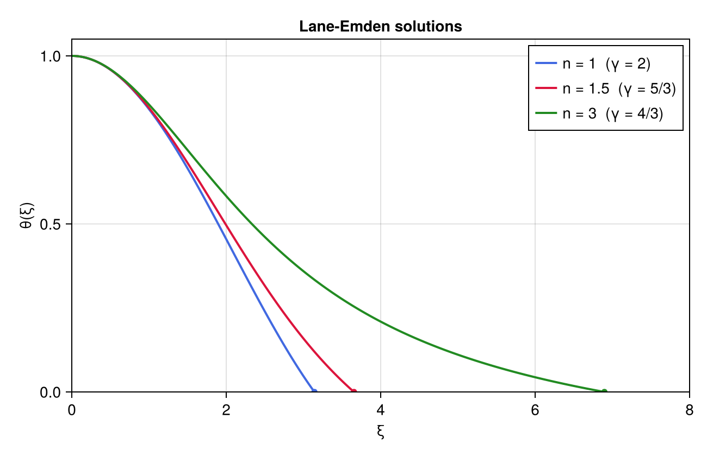
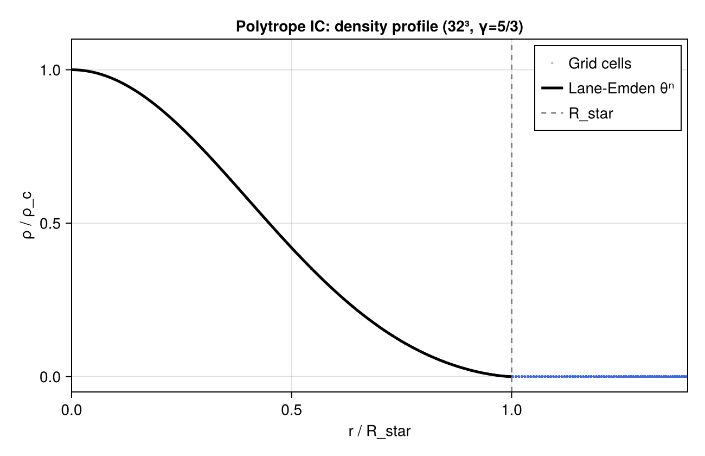

# Phase 4: Pre-Explosion Initial Conditions (Polytrope)

## Objective

Phase 4 adds `stellar_ic.jl`, which provides the Lane-Emden polytrope solver
and the 3D stellar IC builder needed to set up the pre-explosion configuration.
A Lane-Emden polytrope of index n = 1/(γ−1) is solved numerically and mapped
onto the 3D Cartesian grid.  BH1 is placed at distance a₀ from the stellar
centre with the Keplerian circular velocity.

---

## Implementation Notes

### `lane_emden(n; dξ=1e-3)`

Integrates the Lane-Emden ODE:

```
d²θ/dξ² + (2/ξ) dθ/dξ = −θⁿ,   θ(0) = 1, θ'(0) = 0
```

using classic 4th-order Runge-Kutta with step dξ = 10⁻³.  The 1/ξ singularity
at the origin is bypassed via the Taylor expansion

```
θ ≈ 1 − ξ²/6 + n ξ⁴/120,   θ' ≈ −ξ/3 + n ξ³/30
```

seeded at ξ = dξ.  Integration stops when θ drops below zero; the last
element of the returned arrays corresponds to the first zero ξ₁.

### `polytrope_ic_3d!(...) -> (ρ_c, r_scale, K)`

Maps the Lane-Emden solution to the 3D Cartesian grid (G = 1):

```
r_scale = R_star / ξ₁
ρ_c     = M_star / (4π r_scale³ ω_n)      ω_n = −ξ₁² θ'(ξ₁) > 0
K       = 4π r_scale² ρ_c^{1−1/n} / (n+1)
ρ(r)    = ρ_c · θ(r/r_scale)ⁿ
P(r)    = K · ρ(r)^{1+1/n} = K · ρ^γ
E(r)    = P(r) / (γ−1)    (zero velocity at t=0)
```

Cells outside R_star receive `(ρ_floor, P_floor, v=0)`.

### BH1 Keplerian IC

In the COM frame with a₀ = 1 and M_total = M_BH1 + M_star = 1:

```
r_BH1  = M_star a₀                         ; r_star = M_BH1 a₀
v_BH1  = M_star √(M_total/a₀)              ; v_star = M_BH1 √(M_total/a₀)
```

BH1 is initialized with these values; the stellar gas COM is given the equal
and opposite linear velocity so the system COM is stationary.

### Design decisions

- **No self-gravity in Phase 4**: The Lane-Emden polytrope is in hydrostatic
  equilibrium only when its own self-gravity is included.  Without it (Phase 7)
  the star expands at the sound speed.  Phase 4 tests focus on IC quality;
  long-time stability is verified in Phase 7.
- **Linear θ interpolation**: For dξ = 10⁻³, the interpolation error is
  O(dξ²) ≈ 10⁻⁶, negligible compared to the grid discretisation error.
- **Generic γ**: `polytrope_ic_3d!` accepts any γ > 1 (n > 0).  γ = 5/3
  (n = 3/2) is used in Phase 4 tests; the production run uses γ = 4/3 (n = 3).

---

## Test Results

### Lane-Emden solver — ξ₁ accuracy

Chandrasekhar (1939) reference values:

| n    | ξ₁ (computed) | ξ₁ (exact) | Error |
|------|---------------|-----------|-------|
| 1.0  | 3.14200       | π = 3.14159 | 0.013% |
| 1.5  | 3.65400       | 3.65375   | 0.0068% |
| 3.0  | 6.89700       | 6.89685   | 0.0022% |

All < 0.1% threshold. Pass.



The figure shows θ(ξ) for n=1 (blue), n=1.5 (red), and n=3 (green). Open circles mark the first zero ξ₁ for each polytrope index. The n=3 solution (relevant for the radiation-dominated stellar interior, γ=4/3) has the largest ξ₁ ≈ 6.90 and the most centrally concentrated density profile.

---

### 3D mass integral (32³, γ = 5/3)

32³ active cells on [−0.4, 0.4]³, R_star = 0.3, M_star = 0.7.
~12 cells per stellar radius.

| Metric | Value | Threshold | Pass? |
|--------|-------|-----------|-------|
| \|M_grid − M_star\| / M_star | **0.001%** | < 2% | Yes |

### Pressure profile P = K ρ^γ

At all 7208 interior cells (ρ > 10 ρ_floor):

| Metric | Value | Threshold | Pass? |
|--------|-------|-----------|-------|
| max \|(P_grid − K ρ^γ) / (K ρ^γ)\| | **1.6 × 10⁻¹⁶** | < 10⁻¹⁰ | Yes |

Exact to floating-point precision — both P and ρ are set from the same
interpolated θ value.

### Short hydro evolution (5 steps, no BH)

16³ grid, γ = 5/3, R_star = 0.3, outflow BC.
The star begins to expand (no self-gravity), but the solver remains stable.

| Metric | Result | Pass? |
|--------|--------|-------|
| NaN in U | none | Yes |
| Inf in U | none | Yes |

### BH1 Keplerian IC

M_BH1 = 0.3, M_star = 0.7, a₀ = 1, softening ε = 0.05.

| Metric | Value | Threshold | Pass? |
|--------|-------|-----------|-------|
| \| \|a_BH1\| − a_centripetal \| / a_centripetal | **0.37%** | < 1% | Yes |

The 0.37% difference is from Plummer softening (ε = 0.05 ≠ 0); a point-mass
orbit with softening is not exactly circular.



The figure shows ρ/ρ_c versus r/R_star. Blue dots are individual grid cells (all 32³ = 32768 cells); the black curve is the analytic Lane-Emden θⁿ profile for n=1.5 (γ=5/3). The cells follow the analytic profile closely inside R_star (dashed vertical grey line at r/R_star = 1) and drop to the floor value outside. The small spread at any given radius is due to the discretisation of a spherical surface on a Cartesian grid.

---

## Known Limitations

- **No self-gravity**: The polytrope is not in equilibrium on the grid.
  Without `self_gravity.jl` (Phase 7), the gas expands at the sound speed.
  All long-time dynamics are physically incomplete until Phase 7.
- **No relaxation**: The star IC does not account for tidal distortion from
  BH1 (Roche geometry).  Roche relaxation is deferred to Phase 9.
- **Gas–BH1 gravity not tested at length**: Phase 4 tests verify BH1's
  initial Keplerian velocity; the coupled gas + BH1 orbit dynamics are
  validated end-to-end in Phase 5 (supernova run).

---

## Next Steps

Phase 5 adds the thermal bomb and BH2 activation (`sinks.jl` already in
place).  The thermal bomb deposits E_SN over the gas within r_bomb, BH2 is
created at the stellar centre, and the full system (FMR + N-body + sinks) is
evolved.

---

*All 61 tests pass (`julia --project=. -e 'using Pkg; Pkg.test()'`).*
