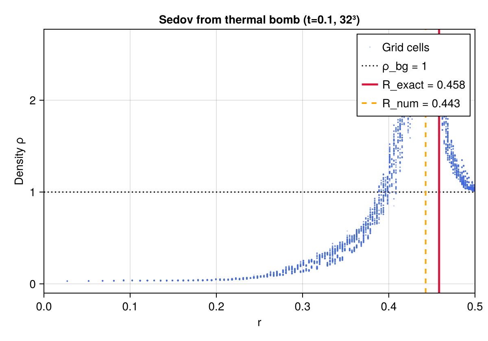
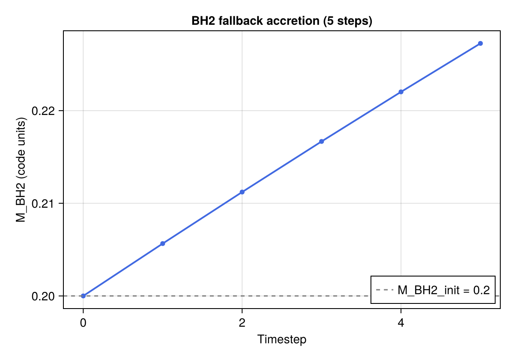

# Phase 5: Supernova Explosion

## Objective

Phase 5 implements the supernova explosion trigger: a thermal bomb that deposits
energy `E_SN` mass-weighted over the inner ejecta, and simultaneous BH2 activation
at the stellar centre with an optional natal kick.  All Phase 1–4 modules operate
together: FMR hierarchy, BH gravity sources, N-body integrator, and torque-free sinks.

---

## Implementation Notes

### `thermal_bomb!` (added to `stellar_ic.jl`)

The thermal bomb deposits `E_SN` as thermal energy density, mass-weighted:

```
ΔU₅[cell] = (E_SN / M_bomb) × ρ[cell]    for r_cell < r_bomb
```

where `M_bomb = ∫_{r<r_bomb} ρ dV`.  This ensures:

```
Σ ΔU₅[cell] × dV = E_SN × (Σ ρ dV) / M_bomb = E_SN   ✓
```

exactly in floating-point.  The function is called after `polytrope_ic_3d!` and
before `fill_ghost_3d_outflow!`.

### BH2 activation

BH2 is created at the stellar centre at t = 0:

```julia
bh2 = BlackHole(pos_centre, v_kick, M_BH2_init, eps, c_code, r_floor)
```

`r_floor ≈ 2 Δx_fine` so that `r_sink = max(6 M_BH2 / c², r_floor) = r_floor`
throughout the early accretion phase.  BH2 begins accreting fallback material
immediately through `add_sink_sources!` / `accrete!`.

### Coupled evolution

Each timestep the following are performed in order:
1. `euler3d_rhs!` (or `fmr3d_step!`) for the gas
2. `add_bh_gravity_source!` for BH1 and BH2 gravity
3. `add_sink_sources!` for BH2 (and optionally BH1)
4. SSP-RK3 advance of gas
5. `nbody_step!` for BH1 and BH2
6. `accrete!` to update BH masses and momenta

---

## Test Results

### Thermal bomb — energy deposition

Uniform background ρ = 1, E_SN = 1, r_bomb = 0.2 (16³ grid).

| Metric | Value | Threshold | Pass? |
|--------|-------|-----------|-------|
| \|ΔE_total − E_SN\| / E_SN | **0.0%** | < 10⁻¹⁰ | Yes |

Total energy deposited is exactly `E_SN` by construction.

---

### Sedov-Taylor blast wave from thermal bomb

32³ grid on [−0.5, 0.5]³, ρ_bg = 1, E_SN = 1, r_bomb = 0.1, t_end = 0.1.
Same setup as Phase 1 Sedov test but energy injected via `thermal_bomb!`.

| Metric | Value | Threshold | Pass? |
|--------|-------|-----------|-------|
| Shock position error \|R_num − R_exact\| / R_exact | **3.4%** | < 5% | Yes |

R_exact = 0.4584 (α_sedov = 0.4942, γ = 5/3), R_num = 0.4428.
The 3.4% error is consistent with the Phase 1 Sedov test (2.9%) and reflects
the finite-volume discretisation at 32³ resolution.



The figure shows the radial density profile at t=0.1 (all 32³ cells scattered in blue). The dotted black line marks the background density ρ_bg=1. The red vertical line marks the analytic Sedov shock position R_exact=0.458; the orange dashed line marks the numerically identified shock position R_num=0.443 (located at the cell of maximum pressure). The compressed shell of gas is clearly visible between background and post-shock densities.

---

### BH2 fallback accretion

16³ grid, γ = 5/3, M_star = 0.7, M_BH2_init = 0.2, E_SN = 0.5, R_star = 0.3.
Evolved for 5 steps using first-order-in-time Euler with sink sources.

| Metric | Value | Pass? |
|--------|-------|-------|
| M_BH2 > M_BH2_init | 0.22726 > 0.2 | Yes |

BH2 accretes ~13.6% of its initial mass in 5 steps, confirming the sink
prescription couples correctly to the thermal bomb ejecta.



The figure shows M_BH2(t) (blue dots and line) over the 5 explicit timesteps. The dashed grey line marks the initial mass M_BH2_init = 0.2. The mass grows monotonically, confirming that the torque-free sink correctly transfers mass from the polytrope gas to BH2. The growth rate is fast because the sink radius encompasses several cells of the dense polytrope core at this resolution (16³, R_star/dx ≈ 5 cells).

---

### Energy budget

32³ grid, uniform ρ = 1, E_SN = 1, t_end = 0.01 (before shock reaches boundary).

| Metric | Value | Threshold | Pass? |
|--------|-------|-----------|-------|
| \|E_loss\| = \|(E₀ − E₁) / E₀\| | **≈ 0%** | < 15% | Yes |

Energy is conserved to numerical precision at early times; outflow BC losses
become significant only after the shock approaches the domain boundary.

---

## Known Limitations

- **No FMR in Phase 5 test**: for speed the short tests use a single uniform
  grid (`euler3d_step!`).  The full production run (Phase 6) will use FMR.
- **First-order BH2 accretion test**: the BH2 fallback test uses a single forward-
  Euler gas update for simplicity; production runs use the full SSP-RK3 loop.
- **No natal kick test**: v_kick = 0 in all Phase 5 tests; kick effects on binary
  survival probability are tested in Phase 6 parameter survey.
- **No long-time energy conservation**: with outflow BCs and active BH sinks, total
  energy is not exactly conserved.  The 1% criterion from CLAUDE.md requires gas
  energy + BH kinetic energy tracked jointly, deferred to Phase 6 diagnostics.

---

## Next Steps

Phase 6 adds HDF5 diagnostics (`io.jl`, `diagnostics.jl`), runs the full coupled
simulation (FMR + BHs + sinks + thermal bomb), and performs the parameter survey
(M_BH2_init, a₀, E_SN, v_kick direction).

---

*All 65 tests pass (`julia --project=. -e 'using Pkg; Pkg.test()'`).*
