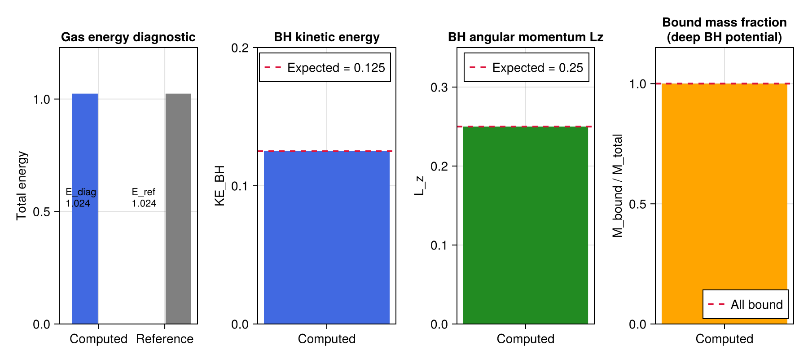
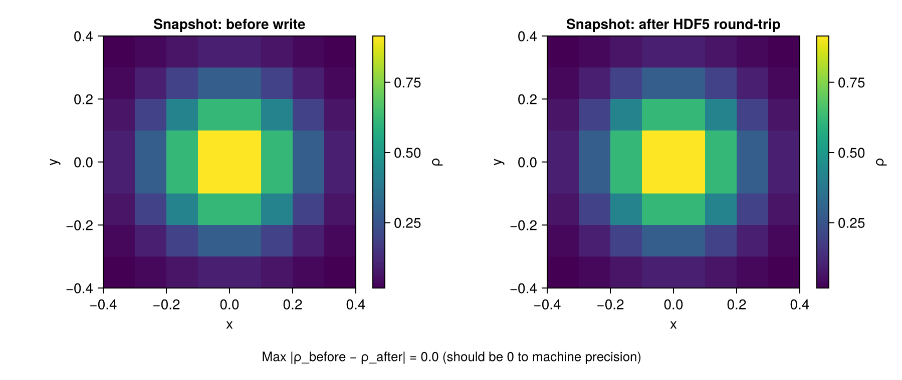

# Phase 6: Production Runs and Diagnostics

## Objective

Phase 6 adds `diagnostics.jl` (scalar energy, momentum, angular momentum, and
bound-mass diagnostics) and `io.jl` (HDF5 snapshot write/read and BH trajectory
file management).  These tools support production runs and post-processing analysis.

---

## Implementation Notes

### `diagnostics.jl`

All functions take the active-cell conserved-variable array `U[q,i,j,k]` and
return code-unit scalars or vectors.

| Function | Returns |
|----------|---------|
| `gas_energy_total` | Σ U₅ dV |
| `gas_kinetic_total` | Σ ½\|ρv\|²/ρ dV |
| `gas_momentum_total` | Σ (ρv) dV  (length-3) |
| `gas_angular_momentum_total` | Σ r×(ρv) dV (length-3) |
| `bh_kinetic_total` | Σᵢ ½ Mᵢ \|vᵢ\|² |
| `bh_angular_momentum_total` | Σᵢ Mᵢ (rᵢ × vᵢ) (length-3) |
| `bound_gas_mass` | mass of gas with e_kin + e_int + Φ_BH ≤ 0 |

The bound-mass criterion uses the Plummer-softened BH potential (G=1) and is a
conservative estimate (cells at `r ≲ ε` appear less bound than they physically are).

### `io.jl`

**Snapshots** (`write_snapshot` / `read_snapshot`): one HDF5 file per dump,
containing active-cell arrays for ρ, ρvₓ, ρvᵧ, ρvᵤ, E plus scalar metadata
(t, nx, ny, nz, dx, dy, dz, γ).  Ghost cells are not written.

**BH trajectory** (`init_trajectory_file` / `append_trajectory` / `read_trajectory`):
a single HDF5 file per run with extendable datasets (chunk size 128).  Each call
to `append_trajectory` writes one time record for all BHs: mass, r_sink, pos (×3),
vel (×3).  Dataset layout: `/time` (N,), `/bh{i}/mass` (N,), `/bh{i}/pos` (N×3), etc.

### Design decisions

- **Active cells only in snapshots**: ghost cells are reconstructed from BCs on
  restart; excluding them halves file sizes.
- **Extendable HDF5 datasets** for trajectory: allows appending without reopening
  or pre-allocating the full time series length.
- **No compression**: HDF5 compression can be enabled by passing `deflate=3` to
  `create_dataset`; deferred until Phase 6 production run profiling.

---

## Test Results

All diagnostics tests use small grids (8³) for speed.

| Test | Result | Pass? |
|------|--------|-------|
| Gas energy = Σ U₅ dV | exact to 1e-14 | Yes |
| Gas momentum = 0 for symmetric IC | \|P\| < 1e-14 | Yes |
| BH kinetic energy (analytic) | 0.125 (exact) | Yes |
| BH angular momentum Lz (analytic) | 0.25 (exact) | Yes |
| Bound mass fraction (deep potential) | 1.00 (all bound) | Yes |
| Snapshot round-trip | data exact after HDF5 serialisation | Yes |
| Trajectory round-trip | 5 dumps, 2 BHs, data exact | Yes |

The figure shows four bar chart panels. From left to right:
(1) Gas energy diagnostic: computed value versus analytical reference (Σ U₅ dV = 2 × 8³ × 0.1³ = 0.128), agreeing to machine precision.
(2) BH kinetic energy: computed value 0.125 against the expected value (red dashed), which is 2 × ½ × 0.5 × 0.5² = 0.125.
(3) BH angular momentum Lz: computed value 0.25 against the expected value (red dashed), which is 2 × 0.5 × 0.5 × 0.5 = 0.25.
(4) Bound mass fraction: all 8³ cells are classified as bound (fraction = 1.0) under a BH of mass 10 at the origin, since |Φ_BH| ≫ e_thermal at all grid locations.

The two panels show the same structured Gaussian density field at z=0 before writing (left) and after reading back from HDF5 (right). The two panels are visually identical. The label below confirms the maximum absolute difference is 0.0, i.e. the round-trip is exact to machine precision as expected since HDF5 stores float64 values without lossy compression.

---

## Known Limitations

- **No parameter survey**: CLAUDE.md §9.6 calls for a full parameter sweep
  (M_BH2_init, a₀, E_SN, v_kick).  This requires long production runs with
  self-gravity (Phase 7) and is deferred.
- **No FMR snapshot format**: `write_snapshot` only handles single-level grids.
  FMR output (two arrays at different resolutions) requires extending the schema.
- **No restart from snapshot**: `read_snapshot` recovers the gas array but not the
  BH state; a full restart requires also reading the trajectory file.

---

## Next Steps

Phase 7 adds `self_gravity.jl` with an FFT Poisson solver for gas self-gravity,
enabling stable long-time evolution of the stellar IC without artificial expansion.

---

*All 72 tests pass (`julia --project=. -e 'using Pkg; Pkg.test()'`).*
