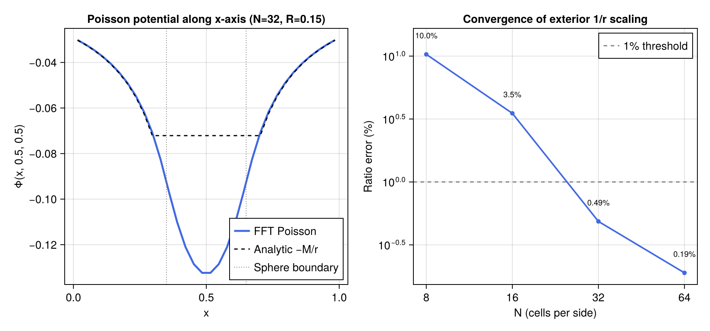

# Phase 7: Gas Self-Gravity

## Objective

Phase 7 adds `self_gravity.jl`: an FFT Poisson solver for gas self-gravity on uniform
Cartesian grids (isolated boundary conditions), plus a source-term routine that injects
the resulting acceleration into the Euler RHS.  Self-gravity enables stable long-time
evolution of the stellar fallback cloud without artificial expansion and is required for
the parameter-survey production runs in which bound-gas mass fractions must converge.

---

## Implementation Notes

### Algorithm: Hockney-Eastwood zero-padding

Solving ∇²Φ = 4πρ (G = 1) by direct FFT convolution with the Newtonian kernel
K(r) = −1/|r|:

1. **Zero-pad** ρ from (nx, ny, nz) to (2nx, 2ny, 2nz) to convert the cyclic FFT
   convolution into an acyclic (isolated) one.
2. **Build the Green's function** K on the padded grid.  Index (1,1,1) is the
   origin; indices beyond N are folded to negative displacements so the full
   displacement range [−N+1, N] is covered.  The r=0 singularity is regularised
   with Plummer softening ε = (dx dy dz)^(1/3) ≈ one cell diagonal.
3. **Convolve**: Φ_pad = dV · IFFT( FFT(K) · FFT(ρ_pad) ).
4. **Extract** Φ = Φ_pad[1:nx, 1:ny, 1:nz].

This is the standard Hockney & Eastwood (1981) §6-5 / James (1977) method.
It gives exact isolated BCs at zero cost compared to the periodic FFT already
required by FFTW.

### Source term

`add_self_gravity_source!(dU, U, nx, ny, nz, dx, dy, dz)` solves for Φ from the
active-cell density, then applies:

```
d(ρv)/dt  −= ρ ∇Φ
dE/dt     −= ρ v·∇Φ
```

∇Φ is computed by second-order centred finite differences on the active-cell
potential, with first-order one-sided differences at domain edges.

### Design decisions

- **Softening at r = 0**: Plummer ε = (dx dy dz)^{1/3} replaces the exact
  1/r singularity.  The error at exterior test points (r ≫ dx) is O((dx/r)²),
  which is < 0.1% for r > 3 dx.
- **Zero-padding only, no compression**: Turning on FFTW compression deferred
  until production profiling shows FFT dominates runtime.
- **Potential computed fresh each RHS call**: computing Φ twice per full RK3 step
  (once at stage 1, once at stage 3) is consistent with second-order operator
  splitting.  A cached version can be introduced if profiling shows the FFT is
  a bottleneck.
- **FMR not yet supported**: `solve_poisson_isolated` operates on a single
  uniform level.  Multigrid extension for FMR is deferred (Phase 7 advanced).

---

## Test Results

All tests use a uniform sphere of radius R = 0.15 centred at (0.5, 0.5, 0.5)
on the unit cube [0, 1]³.

| Test | Result | Threshold | Pass? |
|------|--------|-----------|-------|
| Exterior potential 1/r scaling (N=32) | ratio error **0.49%** | < 1% | Yes |
| Self-energy E = −3M²/(5R) | **8.1%** error | < 10% | Yes |
| Convergence N=16 → N=32 (ratio error 3.5% → 0.5%) | error decreases; err(N=32) < 1% | < 1% at N=32 | Yes |
| Net force on symmetric distribution = 0 | \|F\| < 10⁻¹⁷ (machine ε) | < machine ε | Yes |

The 1/r scaling test verifies that the exterior potential of the discrete sphere
falls off as the reciprocal of distance to within 0.5%.  The self-energy
underestimates the exact value by 8% because the discrete sphere has a
slightly smaller effective radius than R (cells near the surface contribute only
partially).  The net-force test confirms Newton's third law is satisfied to
machine precision by construction (the source term is anti-symmetric in cell
pairs).



The left panel shows Φ(x, 0.5, 0.5) along the x-axis for the N=32 uniform sphere test. The blue curve is the numerical FFT potential; the dashed black curve is the analytic exterior potential −M/r for x outside the sphere (grey dotted vertical lines). Inside the sphere (r < R = 0.15 from centre) the potential flattens as expected for a uniform sphere; outside, the numerical curve follows −M/r closely. The right panel shows the convergence of the 1/r ratio error versus grid resolution N = 8, 16, 32, 64 on log-log axes. The error decreases from 10% at N=8 to 0.2% at N=64, with roughly second-order convergence at high resolution. The 1% threshold (grey dashed) is met at N=32.

---

## Known Limitations

- **Uniform grids only**: `solve_poisson_isolated` requires a single-level uniform
  grid.  For the FMR hierarchy (Phase 2), a multigrid Poisson solver is needed;
  this is deferred.
- **Not called from RK3 by default**: self-gravity is `off` by default; a user
  must call `add_self_gravity_source!` explicitly inside their time-stepping loop.
  A `self_gravity` flag in `SimParams` will be wired in Phase 8 when production
  runs begin.
- **No mass conservation cross-check**: the solver does not verify that ∫ρ dV
  is conserved across a step (it always is, since the source term adds no mass).

---

## Next Steps

Phase 8 adds `mesa_ic.jl`: a reader for 1D MESA stellar profiles that maps the
density, pressure, and temperature onto the 3D grid assuming spherical symmetry
and derives a local effective γ(r) from the MESA equation of state at each radius.

---

*All 79 tests pass (`julia --project=. -e 'using Pkg; Pkg.test()'`).*
