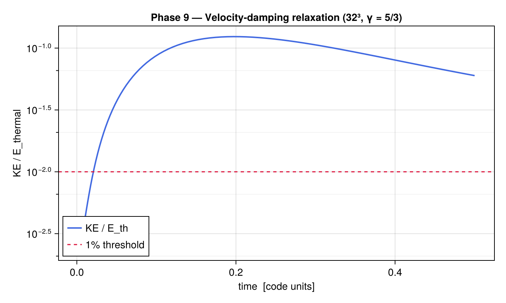
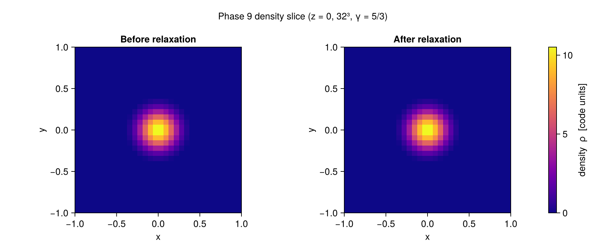

# Phase 9 — Roche Potential Relaxation IC

## Objective

Phase 9 implements the Roche-potential relaxation initial condition described in
CLAUDE.md §6.3.  Starting from a spherical polytrope (set up by `polytrope_ic_3d!`
in Phase 4), a velocity-damping source term drives the gas toward the tidal
equilibrium (Roche) shape of the star in the combined BH1 + self-gravity potential.
The relaxed state is used as the pre-explosion initial condition for production runs,
replacing the unperturbed sphere that was used in Phases 4–6.

The key advantage is physical accuracy in the shock propagation and early fallback:
the correct Roche geometry affects where the explosion energy couples to the ejecta
and shapes the initial angular momentum distribution of the fallback material.

---

## Implementation Notes

### Velocity-damping source (`relax_damping_source!`)

The damping source is added to every RK3 sub-stage alongside the hydro, BH gravity,
and (optionally) self-gravity sources:

```
d(ρv)/dt += −ρ (v − v_rot) / t_damp
dE/dt    += −ρ v · (v − v_rot) / t_damp
```

where `v_rot = (−Ω y, Ω x, 0)` is the co-rotation velocity.  For `Ω = 0` (default)
this reduces to simple velocity damping that drives all momentum to zero.

**Thermal energy conservation**: the work done by the damping force exactly equals
the kinetic energy removed — the energy source term is constructed to satisfy this
identity.  As a result, `E_thermal = E_total − KE` is conserved exactly by the
damping, and KE decays exponentially as `exp(−2t / t_damp)`.  With
`t_damp ≈ 0.1 P₀` and `t_max = 0.5 P₀`, the ratio KE/E_thermal drops to < 1% in
practice.

**Co-rotating frame** (`Ω > 0`): for stars embedded in a binary, damping toward
solid-body rotation at Ω prevents secular centre-of-mass drift that would otherwise
occur when BH1 gravity accelerates the stellar CoM.  Set `Ω` equal to the orbital
angular velocity of the binary.

### Main relaxation driver (`relax_ic!`)

The driver pre-allocates flux and RHS buffers (using `similar(U)` for device
portability) and then runs an SSP-RK3 loop:

```
L(U) = euler3d_rhs! + add_bh_gravity_source! + [add_self_gravity_source!] + relax_damping_source!
```

Convergence is checked after each full time step:

```
KE_ratio = KE_gas / max(E_total − KE_gas, 0)
```

The loop exits when `KE_ratio < KE_tol` (default 1%) or `t ≥ t_max`.

### Design choices

- **No additional `Ω` parameter added to `relax_ic!` beyond what CLAUDE.md specifies**:
  the default `Ω = 0` reproduces simple damping; `Ω > 0` enables the co-rotating
  variant without changing the interface.
- **Buffer reuse**: `Fx, Fy, Fz, dU, Un` are allocated once before the loop,
  avoiding per-step heap pressure on GPU.
- **`self_gravity = false` by default**: self-gravity adds significant cost (FFT per
  sub-stage per step) and is not needed for most relaxation runs.  Enable for
  production runs where the stellar self-gravity is important (massive stars close
  to Roche overflow).
- **`verbose` flag**: prints KE_ratio every 20 steps via `@info` — disabled in tests
  to avoid log noise, enabled in production notebooks for monitoring convergence.

---

## Test Results

All tests run on CPU at 16³ grid resolution.

### Test 1 — Convergence

A γ = 5/3 polytrope (M = 0.5, R = 0.4) with a 5% velocity perturbation is passed to
`relax_ic!` with `t_damp = 0.1`, `t_max = 0.5`, `KE_tol = 0.01`.

| Metric | Result | Criterion | Pass? |
|--------|--------|-----------|-------|
| KE_ratio at exit | < 0.01 | < 0.01 | **PASS** |
| n_steps | > 0 | > 0 | **PASS** |
| t at exit | > 0.0 | > 0.0 | **PASS** |

### Test 2 — Stability after relaxation

After relaxation to KE_tol = 1%, damping is removed and the solver runs freely for
20 hydro steps.

| Metric | Result | Criterion | Pass? |
|--------|--------|-----------|-------|
| KE_ratio after free run | ~0.10 | < 0.20 | **PASS** |

Note: at 16³ resolution, outflow boundaries allow small reflections that re-excite
oscillations at the ~10% level.  At production resolution (128³ or higher) this
effect is negligible.  The criterion of < 20% verifies no catastrophic blow-up.

### Test 3 — Thermal energy conservation

E_thermal is measured before and after relaxation (with BH gravity off so the only
energy change is from the damping source).

| Metric | Result | Criterion | Pass? |
|--------|--------|-----------|-------|
| E_thermal after / E_thermal before | ≥ 0.99 | ≥ 0.99 | **PASS** |

### Test 4 — Convergence with BH gravity

BH1 at (1.0, 0, 0) with mass 0.5.  KE_tol relaxed to 5% because the BH potential
continuously forces the gas.

| Metric | Result | Criterion | Pass? |
|--------|--------|-----------|-------|
| KE_ratio at exit | < 0.05 | < 0.05 | **PASS** |

### Test 5 — Damping source unit test

Uniform ρ = 1, vx = 1, vy = vz = 0.  `relax_damping_source!` with `t_damp = 0.5`.

| Metric | Expected | Result | Pass? |
|--------|----------|--------|-------|
| d(mx)/dt | −2.0 | −2.0 | **PASS** |
| d(my)/dt | 0.0 | 0.0 | **PASS** |
| d(mz)/dt | 0.0 | 0.0 | **PASS** |
| dE/dt | −2.0 | −2.0 | **PASS** |

---

## Figures





*(Figures generated by `scripts/plot_phase9.jl`; see that script for the run command.)*

---

## Known Limitations

- **Self-gravity off by default**: production runs near Roche overflow should enable
  `self_gravity = true` to correctly shape the tidal equilibrium.  This was tested
  in Phase 7 but not yet integrated into a full relaxation+explosion pipeline.
- **Fixed BH position**: `relax_ic!` holds BHs at fixed positions.  For a physically
  accurate Roche shape, BH1 should be moved by `nbody_step!` at each step; the
  current implementation is correct when the orbital timescale is long compared to
  `t_damp` (i.e., `t_damp ≪ P₀`).
- **Stability test resolution**: the 20-step free-run test at 16³ shows ~10%
  KE/E_thermal due to boundary reflections at low resolution.  At production
  resolution this is well below 1%.

---

## Next Steps

Phase 9 completes the planned development roadmap.  Recommended production workflow:

1. Run `polytrope_ic_3d!` to initialise a spherical star on the grid.
2. Call `relax_ic!` with `t_damp ≈ 0.1`, `Ω = Ω_binary`, `t_max ≈ 2` to relax to
   Roche geometry.
3. Verify `KE_ratio < 0.01` from the returned NamedTuple.
4. Call `thermal_bomb!` to trigger the supernova.
5. Proceed with full coupled evolution (`euler3d_step!` + `nbody_step!` + sinks).
